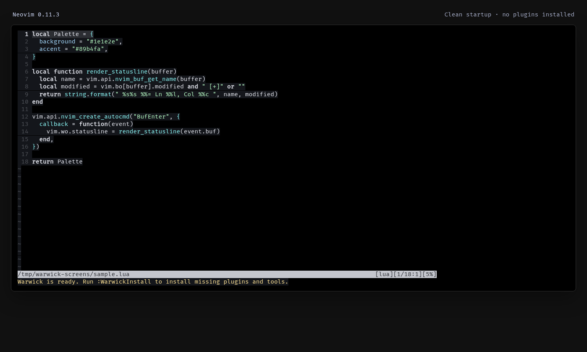
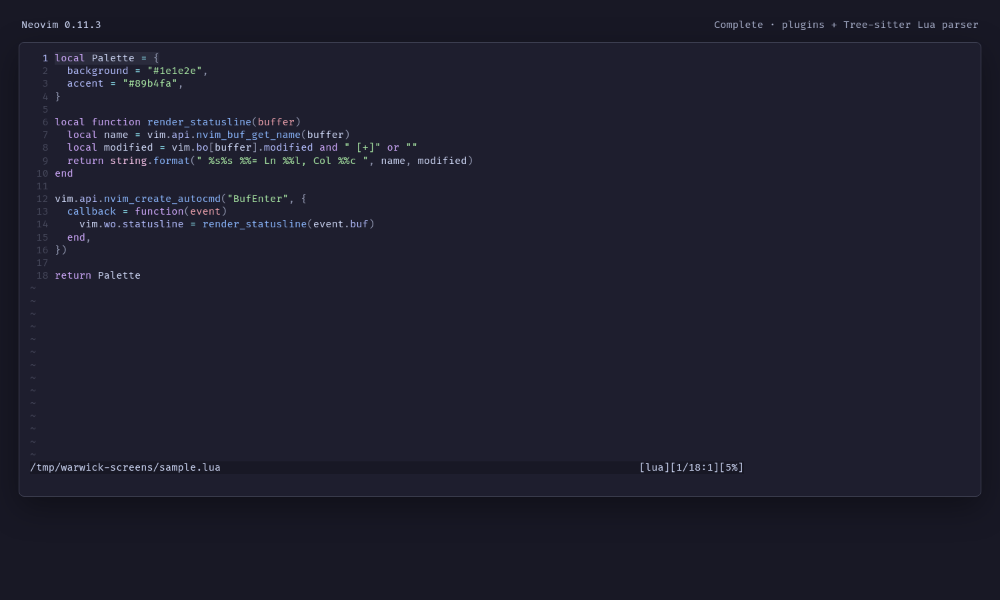

# Warwick Vim

Fast, restrained Vim and Neovim configuration for terminals, servers, and
day-to-day development. Vim is the reference experience; Neovim keeps that
foundation while adding Telescope, Tree-sitter, LSP, and completion.

## First run

Link this [Homeshick][] castle, then open Vim or Neovim. The editor starts even
when no plugins are installed and tells you what to do next:

```vim
:WarwickInstall
```

That single command installs the editor's plugins. In Neovim it also installs
Tree-sitter parsers and the configured language servers. Normal startup never
installs or updates dependencies, or reformats files.

Vim 9 is supported. Neovim's LSP integration requires Neovim 0.11.3 or newer.

[Homeshick]: https://github.com/andsens/homeshick

## First-start experience

These captures show the same Lua file in Neovim 0.11.3 with an empty plugin
home and with the configured editor UI, plugins, and Lua parser loaded. They
were captured from a 116×34 terminal and rendered with FiraCode Nerd Font Mono.
The terminal controls the font; it is not an editor dependency.

**Clean startup — no plugins installed:**



**Complete setup — plugins, Catppuccin, and Tree-sitter:**



## Principles

- Vim behavior is the baseline; shared behavior lives in `home/.vim/vimrc`.
- Vim and Neovim preserve the same core mappings while using the finder best
  suited to each editor: CtrlP in Vim and Telescope in Neovim.
- Plugins must provide a regularly used capability that Vim cannot provide
  simply enough by itself.
- Language-specific settings are buffer-local and never rewrite a file merely
  because it was opened or saved.
- Missing optional tools may disable a command, but must not prevent startup.

## Included capabilities

The shared core uses Fern, Fugitive, Catppuccin, GitHub Copilot, and a plain
native statusline. Fern and Fugitive load only when used. Vim adds CtrlP and the
EditorConfig plugin; Neovim uses its built-in EditorConfig support.

Neovim additionally uses Telescope, Tree-sitter, its native LSP client, and
nvim-cmp with vsnip. Parsers and language servers are installed only through
`:WarwickInstall`. Vim intentionally stays free of an LSP framework.

## Mappings

The leader key is Vim's default `\`.

| Mapping | Action |
| --- | --- |
| `Ctrl-N` | Toggle the Fern project drawer |
| `Ctrl-P` | Find a project file with CtrlP or Telescope |
| `<leader>gb` | Find an open buffer |
| `<leader>s` | Search for the word under the cursor in the quickfix list |
| `<leader>ve` | Edit the active configuration |
| `<leader>vr` | Reload the active configuration |
| `Ctrl-J` | Accept a Copilot suggestion |

Neovim additionally provides Telescope live grep with `<leader>gg`. LSP buffers
provide `gd`, `gD`, `gi`, `gr`, `<leader>d`, `<leader>f`, and completion through
nvim-cmp. `Ctrl-Space` opens completion explicitly; `Tab` selects or expands.

Filetype-specific mappings live under `home/.vim/after/ftplugin/` and are kept
local to their buffers.

## Measuring startup

Measure rather than keeping an aspirational number in this README:

```sh
vim --startuptime /tmp/warwick-vim.log +qall
nvim --startuptime /tmp/warwick-nvim.log +qall
for log in /tmp/warwick-vim.log /tmp/warwick-nvim.log; do
  awk 'NF { last = $0 } END { print FILENAME ": " last }' "$log"
done
```
